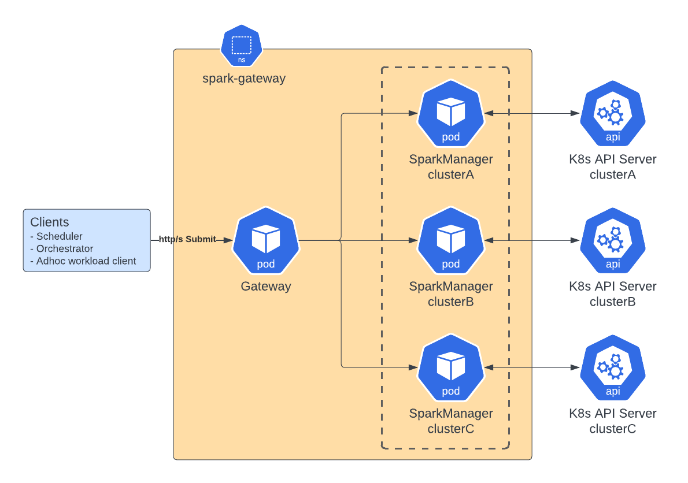

# Spark Gateway

**Spark Gateway** is a load balancer and a routing gateway for submitting [SparkApplication](https://www.kubeflow.org/docs/components/spark-operator/user-guide/using-sparkapplication/) resources to one or more Kubernetes clusters.

Originally inspired by Apple's [Batch Processing Gateway](https://github.com/apple/batch-processing-gateway), Spark
Gateway's implementation is written in Go, directly integrating with the Go based [kubeflow/spark-operator](https://github.com/kubeflow/spark-operator)
project and using native Go Kubernetes client libraries.

---

## Features
- 🔌 REST API endpoints to manage [`SparkApplication`](https://github.com/kubeflow/spark-operator/blob/master/docs/api-docs.md) resources
- 🌐 Submission to multiple Kubernetes clusters using a single client
- 🚀 Enables zero downtime deployments and upgrades of Spark-on-k8s infrastructure
- 📝 Enables audit logging of SparkApplication submissions
- ⚡ Gateway runs Kubernetes Controller to efficiently track a large number of SparkApplications
- 📋 Enables access to Spark Driver logs via REST

---

## API Docs UI

Spark-Gateway includes a REST API documentation with Swagger 2.0 running alongside the API.

* **API**: `http://127.0.0.1:8080/api/v1/applications`
* **API Docs UI**: `http://127.0.0.1:8080/docs`

---

## Getting Started

### Prerequisites
- **Docker** - [Docker Desktop](https://docs.docker.com/desktop/)
- **Kubernetes** - For local Kubernetes install, see the [Minikube Guide](./docs/minikube.md)
- **Helm** - [Install Guide](https://helm.sh/docs/intro/install/)
- **SparkApplication CRDs** - Apply CRDs defined in [kubeflow/spark-operator](https://github.com/kubeflow/spark-operator/tree/master/charts/spark-operator-chart/crds)
  using `kubectl apply --server-side -f file-name`

### 1. Clone the Repository

```bash
git clone git@github.com/slackhq/spark-gateway
cd spark-gateway
```

---

### 2. Build and Deploy

```bash
docker build -t spark-gateway:latest .
helm upgrade --install \
  spark-gateway \
  ./helm/spark-gateway
```
> port-forward: You can follow the Helm upgrade command's output notes to run port-forward.

---

### 3. Manage SparkApplication via REST endpoints

Submit a SparkApplication ([example](https://github.com/kubeflow/spark-operator/blob/master/examples/spark-pi-python.yaml)) 
in json format: `yq -o=json . spark-pi-python.yaml > spark-pi-python.json`

#### Create SparkApplication
```bash
curl -X POST -H "Content-Type: application/json" \
  --data-binary @spark-pi-python.json \
  "127.0.0.1:8080/api/v1/applications"
```

#### List SparkApplications
```bash
# List SparkApps in the default cluster and default namespace
curl -X GET -H "Content-Type: application/json" \
  --user gateway-user:pass \
  "127.0.0.1:8080/api/v1/applications?cluster=default&namespace=default"
  
# List all SparkApps in the default cluster
curl -X GET -H "Content-Type: application/json" \
  --user gateway-user:pass \
  "127.0.0.1:8080/api/v1/applications?cluster=default"
```

#### Get SparkApplication
```bash
# Get all fields of a SparkApplication
curl -X GET -H "Content-Type: application/json" \
  --user gateway-user:pass \
  "127.0.0.1:8080/api/v1/applications/dflt-dflt-01982d11-c2c1-7c3d-8b2f-944ae7248434"

# Get only the status field
curl -X GET -H "Content-Type: application/json" \
  --user gateway-user:pass \
  "127.0.0.1:8080/api/v1/applications/dflt-dflt-01982d11-c2c1-7c3d-8b2f-944ae7248434/status"
```

#### Get Driver Logs
```bash
# By default returns last 100 lines of the driver logs.
# Pass the `line=x` query parameter to get a different amount. Eg: ?lines=200
curl -X GET -H "Content-Type: application/json" \
  --user gateway-user:pass \
  "127.0.0.1:8080/api/v1/applications/dflt-dflt-01982d11-c2c1-7c3d-8b2f-944ae7248434/logs"
```

#### Delete SparkApplication
```bash
curl -X DELETE -H "Content-Type: application/json" \
  --user gateway-user:pass \
  "127.0.0.1:8080/api/v1/applications/dflt-dflt-01982d11-c2c1-7c3d-8b2f-944ae7248434"
```

# Architecture


- **🚪 Gateway** is responsible for routing SparkApplication to Kubernetes clusters. It runs a REST server that accepts
  requests from clients and routes requests to the appropriate SparkManager instance.
- **⚙️ SparkManager** runs a REST server and a Kubernetes Informer to track SparkApplication resources in a specific 
  Kubernetes cluster via its Kube API Server. There is one SparkManager per Kubernetes cluster where SparkApplication 
  resources can be submitted. Having cluster specific SparkManager service allows the Spark Gateway to support many Kubernetes
  clusters.

# Configuration

Spark Gateway uses a YAML configuration file that can be passed to both `gateway` and `sparkManager` processes via the `--conf` flag. For detailed configuration options and examples, see [Configuration Documentation](./docs/Configurations.md).

## Development

### Install Go and Dependencies

1. **Install Go:**
   - Download and install Go from the [official website](https://go.dev/dl/).
   - Verify installation:
     ```bash
     go version
     ```

2. **Install project dependencies:**
   - Run the following command in the project root to download all Go module dependencies:
     ```bash
     go mod tidy
     ```

### Running Gateway and SparkManager Locally

You can run both Gateway and SparkManager locally for development and testing.

#### 1. Run SparkManager

```bash
go run cmd/sparkManager/main.go --conf ./config/gateway-config-dev.yaml --cluster minikube
```
- The `--cluster` flag for SparkManager should match a cluster defined in your config.

#### 2. Run Gateway
Open a new terminal:
```bash
go run cmd/gateway/main.go --conf ./config/gateway-config-dev.yaml
```

#### 3. Test Local Deployment
Open a new terminal:
```bash
curl -X GET -H "Content-Type: application/json" \
  --user gateway-user:pass \
  "127.0.0.1:8080/api/v1/applications?cluster=minikube"
```

### sqlc
This project uses sqlc to generate Go code that presents type-safe interfaces to sql queries. The application code calls
the sqlc generated methods.

Generate code
```
go install github.com/sqlc-dev/sqlc/cmd/sqlc@latest
sqlc generate
```

### Moq
[matryer/moq](https://github.com/matryer/moq) project is used to generate mock interfaces.

To generate mocks, run `go generate`.

### Swagger Docs
[gin-swagger](https://github.com/swaggo/gin-swagger/tree/master) gin middleware is used to automatically generate 
RESTful API documentation with Swagger 2.0.

Generate docs
```bash
go install github.com/swaggo/swag/cmd/swag@latest
swag init -d ./internal/gateway/api/api/v1/kubeflow -g application_handler.go -o ./docs/swagger --parseDependency --parseInternal
```

### 🐘 Local Postgres Database
For local testing, Spark-Gateway will need access to a Postgres database.

#### 📋 Steps to deploy a local Postgres on Kubernetes
```bash
# Set a cluster and namespace in your kubecontext
kubectl config use-context <cluster>
kubectl config set-context --current --namespace=<namespace>

# Install Help charts
helm repo add bitnami https://charts.bitnami.com/bitnami
helm repo update
helm install my-postgres bitnami/postgresql \
	--set image.registry=your.docker.registry \
  	--set image.repository=bitnami/postgresql \
  	--set image.tag=17.3.0-debian-12-r1 \
  	--set global.security.allowInsecureImages=true

# Get DB Password from Kube Secret
export DB_PASSWORD=$(kubectl get secret --namespace spark-gateway my-postgres-postgresql -o jsonpath="{.data.postgres-password}" | base64 -d)

# Create table, get the latest schema from pkg/database/repository/schema.sql
kubectl exec -it my-postgres-postgresql-0 -- \
	env PGPASSWORD="$DB_PASSWORD" \
	psql 	-U postgres \
			-d postgres \
			-c "CREATE TABLE spark_applications (
				    uid UUID PRIMARY KEY,                   -- Updated by Gateway after submission
				    name TEXT,                              -- Updated by Gateway after submission
				    creation_time TIMESTAMPTZ,              -- Updated by Gateway after submission
				    termination_time TIMESTAMPTZ,           -- Updated by SparkManager Controller
				    username TEXT,                          -- Updated by Gateway after submission
				    namespace TEXT,                         -- Updated by Gateway after submission
				    cluster TEXT,                           -- Updated by Gateway after submission
				    submitted JSONB,                        -- Updated by Gateway after submission
				    updated JSONB,                          -- Updated by SparkManager Controller
				    state TEXT,                             -- Updated by SparkManager Controller
				    status JSONB                            -- Updated by SparkManager Controller
				);"
  
# Run port-forward
kubectl port-forward service/my-postgres-postgresql 5432:5432
```

Final step is updating Spark-Gateway config.yaml:
```yaml
database:
  databaseName: "postgres"
  hostname: "localhost"
  port: 5432
  username: "postgres" # DB_USERNAME env var is used if not present
  password: "DB_PASSWORD_from_kube_secret" # DB_PASSWORD env var is used if not present
```
