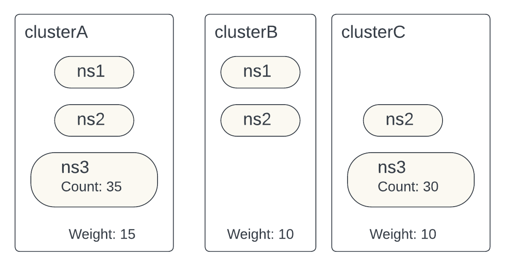
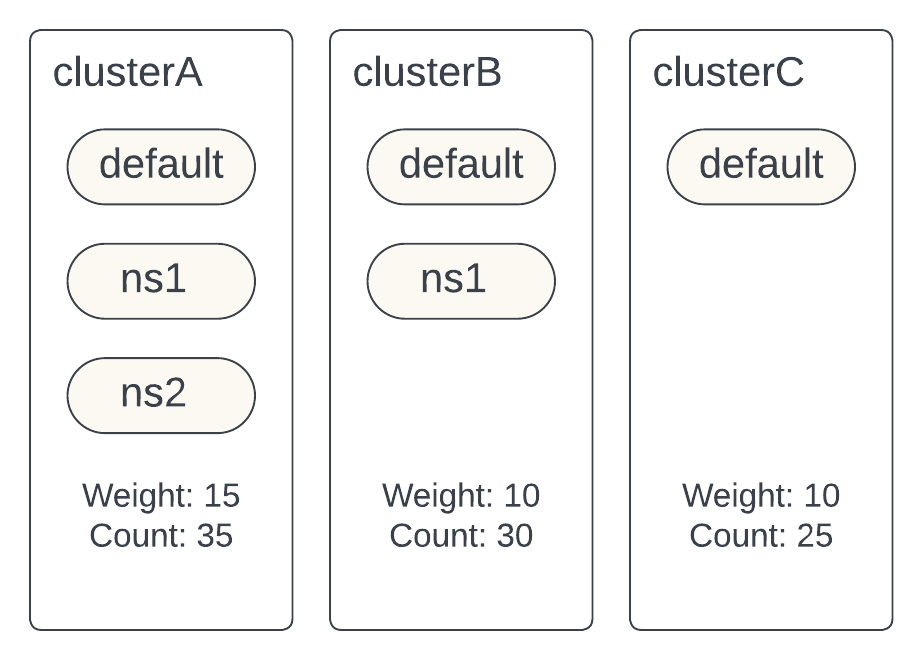
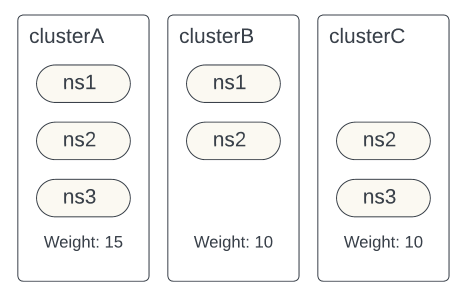

# Multi-Cluster Routing

Spark Gateway can route Spark Applications to multiple Kubernetes clusters to the
user defined namespace. Spark Gateway will use the namespace defined in the
SparkApplication and will use the routing logic to determine with cluster and user 
defined namespace to route to.

Some common deployment patterns for Kubernetes clusters include:
- cluster per team, all namespace owned by the same team
- cluster per usecase. IE stable vs spiky usecase, or batch vs adhoc.
- Shared clusters with namespace per team.

Spark Gateway aims to increase stability (reduce autoscaling) and improve
efficiency (higher resource utilization) with multi-cluster routing feature.

Spark Gateway will use the user defined clusters and namespaces allow list
from the [Gateway config](../README.md#configurations) to determine eligible 
clusters and namespaces for routing.

# Routing Types
## Weight based routing
Each cluster has a weight assigned to use for weighted distribution. Weighted distribution
will be based on some metric and domain. Metric and domain will be used to calculate the 
proportions that match the cluster’s weight.

### Configurations
#### Metric
Metric to use for measuring the ratio between clusters.

Possible values: `'', `SparkApp`, `CPU`, `Memory`, `Queue_Name`

#### Domain
Domain can either be `namespace` or `cluster`. Metric and domain will be used determine
the count.

Possible values: `namespace`, `cluster`, `label` (in the future if needed)

##### Example with `sparkApp` metric and `namespace` domain

If the domain is `namespace`, metric is `SparkApp`, and user is submitting the SparkApp to
`ns3` namespace then the count of SparkApps in `ns3` namespace in cluster A and C will be 
used to calculate the ratios and choose a cluster.

**Choose cluster logic**

    # Determine weight ratios    
    cluster A = weight(clusterA) / (weight(clusterA) + weight(clusterC))
    cluster A weight ratio = 15 / (15 + 10) = 0.6
    cluster C weight ratio = 10 / (15 + 10) = 0.4
 
    # Determine current ratios
    total count = count(clusterA_ns3) + count(clusterC_ns3) = 35 + 30 = 65
    cluster A ns3 current ratio = count(clusterA_ns3) / total count = 35 / 65 = 0.54
    cluster C ns3 current ratio = count(clusterC_ns3) / total count = 30 / 65 = 0.46

    # Deteremine the difference in ratios
    cluster A ns3 difference = cluster A weight ratio - cluster A ns3 current ratio  = 0.6 - 0.54 =  0.04
    cluster C ns3 difference = cluster C weight ratio - cluster C ns3 current ratio  = 0.4 - 0.46 = -0.06
    
    # Choose a cluster with the highest difference
    chosen_cluster = max_difference(cluster A ns3, cluster C ns3) = max(0.04, -0.06) = cluster A
    return chosen_cluster

##### Example with `sparkApp` metric and `cluster` domain

If the domain is `cluster`, metric is `SparkApp`, the count of all SparkApps in cluster A, B and C 
will be used to calculate the ratios and choose a cluster, regardless of the namespace defined by 
the user.

**Choose cluster logic**

    # Determine weight ratios    
    cluster A = weight(clusterA) / (weight(clusterA) + weight(clusterB) + weight(clusterC))
    cluster A weight ratio = 15 / (15 + 10 + 10) = 0.43
    cluster B weight ratio = 10 / (15 + 10 + 10) = 0.285
    cluster C weight ratio = 10 / (15 + 10 + 10) = 0.285

    # Determine current ratios
    total count = count(clusterA) + count(clusterB) + count(clusterC) = 35 + 30 + 25 = 90
    cluster A current ratio = count(clusterA) / total count = 35 / 90 = 0.39
    cluster B current ratio = count(clusterB) / total count = 30 / 90 = 0.33
    cluster C current ratio = count(clusterC) / total count = 25 / 90 = 0.28

    # Deteremine the difference in ratios
    cluster A difference = cluster A weight ratio - cluster A current ratio  = 0.43  - 0.39 =   0.040
    cluster B difference = cluster B weight ratio - cluster B current ratio  = 0.285 - 0.33 =  -0.045
    cluster C difference = cluster C weight ratio - cluster C current ratio  = 0.285 - 0.28 =   0.005 

    # Choose a cluster with the highest difference
    chosen_cluster = max_difference(cluster A, cluster B, cluster C) = max(0.040, -0.045, 0.005) = cluster A
    return chosen_cluster

##### Example with `''` metric
If metric is set to `None`, the weights and some randomness will be used to determine the
cluster for submission. Note that the domain field will be ignored.

For instance in below scenario, if an app is submitted to **ns3**, the weights of clusterA
and clusterC and a random number between 0 and Sum of the weights for cluster A and C will be
used to determine which cluster to submit to.

**Choose cluster logic**

    Cluster A = weight(clusterA) / (weight(clusterA) + weight(clusterC))
    Cluster A = 15 / (15 + 10) = 0.6
    cluster B = 10 / (15 + 10) = 0.4

    # RandomInt generated for each submission request
    randomInt = Random(0, weight(clusterA) + weight(clusterC) ) = 17

    cumulative_weight = 0
    for c in clusters:
        cumulative_weight += weight(c)
        if cumulative_weight > randomInt:
            return c

## Implementation

Each cluster specific SparkManager will emit metrics for that cluster via `/metrics` endpoint.

Endpoint schema: /<api-version>/metrics/<domain-name>/<metric-name>
